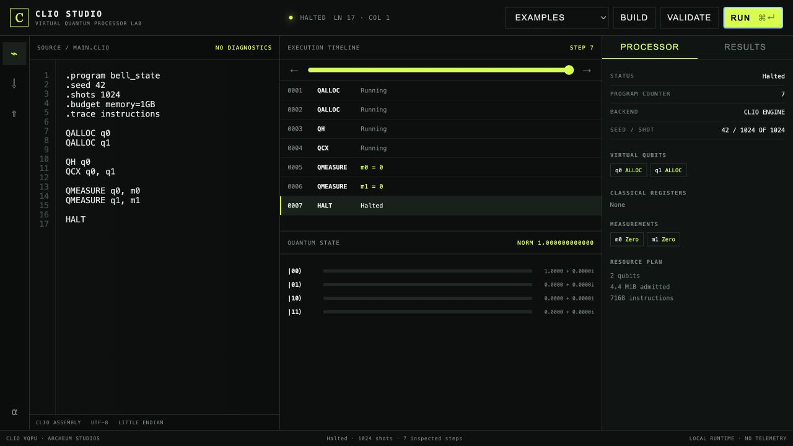
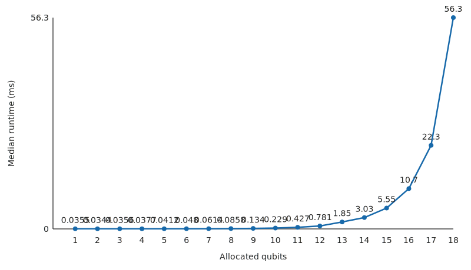

# Clio VQPU

[](https://doi.org/10.5281/zenodo.21403143)
[](https://github.com/archeumstudios/clio-vqpu/actions/workflows/ci.yml)
[](LICENSE)

**A programmable virtual quantum processing architecture implemented as an independent Rust system.**

Created and led by **Advaith Praveen** under Archeum Studios.

Clio VQPU asks what a quantum computer looks like when it is designed as a complete virtual processor rather than exposed only as a circuit library. The result is a software-defined architecture with its own instruction set, processor state, assembly language, runtime, state-vector engine, hybrid classical–quantum control, tracing, replay, resource admission, developer tools, and visual laboratory.

Clio executes real quantum-state evolution through classical simulation. It is not physical quantum hardware and does not claim quantum advantage. The complete implementation, specifications, benchmark evidence, research paper, and reproducibility artifacts are preserved in this repository.

## Research paper

### *Clio: Design, Implementation, and Evaluation of a Programmable Virtual Quantum Processing Unit*

**Author:** Advaith Praveen · **Publisher:** Archeum Studios · **Release:** `definitive-release`

**Permanent archive:** [doi:10.5281/zenodo.21403143](https://doi.org/10.5281/zenodo.21403143)

[**Read the 93-page paper on GitHub**](output/pdf/clio-vqpu-research-paper.pdf) · [**Open the permanent Zenodo record**](https://zenodo.org/records/21403143) · [**View the definitive release**](https://github.com/archeumstudios/clio-vqpu/releases/tag/definitive-release)

The monograph documents the architecture, ISA, processor model, runtime, execution engine, validation methodology, benchmark protocol, experimental results, Clio Studio, reproducibility procedure, security boundary, related work, and limitations.

## What Clio contains

| Layer | Implementation |
|---|---|
| Programming model | Clio Assembly with directives, typed operands, labels, diagnostics, and disassembly |
| Processor architecture | Explicit lifecycle, program counter, quantum/classical/measurement registers, comparison state, traps, and budgets |
| Quantum execution | Independent little-endian complex state-vector engine with seeded measurement and collapse |
| Hybrid runtime | Checked arithmetic, logic, comparison, branches, loops, measurement-driven control, and resource limits |
| Developer interfaces | Rust SDK, `clio` CLI, replay tool, benchmark harness, and Clio Studio |
| Evidence | Known-answer, property, regression, statistical, replay, resource, and Qiskit differential validation |

Implemented quantum operations include X, Y, Z, H, S, S†, T, T†, RX, RY, RZ, CX, CZ, controlled phase, SWAP, and CCX, together with allocation, reset, measurement, observation, and safe release.

Canonical programs include Bell and GHZ states, Grover search, QFT round-trip, quantum teleportation, Bernstein–Vazirani, Deutsch–Jozsa, measurement-driven branching, classical conformance, and resource-limit traps.

## Clio Studio

Clio Studio is a local visual processor laboratory backed by the real Clio SDK and runtime—there is no mock execution path. It provides source editing, examples, build/run/validation, instruction timeline scrubbing, processor state, bounded state-vector inspection, registers, measurements, resource plans, results, and replay verification.

[](docs/reference/studio.md)

Launch it locally:

```bash
cargo run --release -p clio-studio
```

Then open `http://127.0.0.1:4317`.

## Verified results

- **68 Rust tests** passed across the workspace at the definitive release gate.
- **330 final benchmark measurements** were retained with raw data, environment metadata, checksums, and a frozen processing path.
- Bell, GHZ, Grover, QFT, Bernstein–Vazirani, and Deutsch–Jozsa state vectors passed the external Qiskit comparison.
- The largest recorded amplitude difference in that comparison was below `7 × 10⁻¹⁶`.
- Identical seeds reproduce measurement counts and execution traces.
- Replay verification rejects source mutation and execution-identity drift.
- Resource admission checks memory, qubits, shots, instructions, trace growth, and time before or during execution.



These measurements describe the documented test machine and protocol; they are not claims of general superiority over other simulators. See the [benchmark guide](research/benchmarks/README.md), [raw final results](research/benchmarks/final/raw/benchmark-results.csv), [processed summary](research/benchmarks/final/processed/benchmark-summary.csv), and [Qiskit comparison](research/benchmarks/external/qiskit-comparison.csv).

## Quick start

Requirements: Rust `1.93.0` and Cargo.

```bash
git clone https://github.com/archeumstudios/clio-vqpu.git
cd clio-vqpu
cargo build --release --workspace
cargo run --release -p clio-cli -- check examples/bell-state/main.clio
cargo run --release -p clio-cli -- run examples/bell-state/main.clio --json
```

The Bell program is ordinary Clio Assembly:

```text
.program bell_state
.seed 42
.shots 1024
.budget memory=1GB
.trace instructions

QALLOC q0
QALLOC q1
QH q0
QCX q0, q1
QMEASURE q0, m0
QMEASURE q1, m1
HALT
```

Expected measurement support is restricted to correlated outcomes `00` and `11`.

## Processor pipeline

```text
Clio Assembly
    → parser and typed AST
    → semantic validation and assembler
    → resource admission
    → Clio Runtime
    → Clio Engine or backend
    → result, trace, observation, and replay package
```

The Clio architecture owns this pipeline. Qiskit is used only as an external differential baseline and is not required for local execution.

## Repository map

```text
crates/          Core types, ISA, parser, assembler, engine, runtime, SDK, CLI, Studio, replay, and bench
spec/            Normative architecture, processor-state, ISA, assembly, and format specifications
examples/        Executable Clio Assembly programs and known-answer workloads
docs/            Tutorials, SDK/Studio references, security model, and release documentation
research/        Paper sources, benchmark protocols, raw evidence, processed results, and figures
output/pdf/      Complete generated research monograph
packaging/       Release construction and CycloneDX SBOM tooling
.github/         Linux CI and external Qiskit validation
```

Start with the [architecture overview](spec/architecture/overview.md), [ISA summary](docs/reference/isa-summary.md), [Bell tutorial](docs/tutorials/bell-state.md), [SDK reference](docs/reference/sdk.md), or [Studio guide](docs/reference/studio.md).

## Reproduce the evidence

Run the complete local quality gate:

```bash
cargo fmt --all -- --check
cargo clippy --workspace --all-targets --all-features -- -D warnings
cargo test --workspace --all-targets --locked
python3 research/benchmarks/scripts/evidence_integrity.py
```

See [research/benchmarks/README.md](research/benchmarks/README.md) for benchmark reproduction and [docs/reference/release.md](docs/reference/release.md) for release packaging, SBOM generation, and checksum verification.

## Honest limitations

- Clio simulates quantum states on classical hardware; memory grows exponentially with simulated qubit count.
- A dense `n`-qubit state stores `2ⁿ` complex amplitudes, approximately `16 × 2ⁿ` raw bytes at double precision before runtime overhead.
- Benchmark results are machine- and protocol-specific.
- The external Qiskit comparison covers six pure-state workload families; it is evidence of agreement for those cases, not a proof of universal equivalence.
- Clio does not claim physical quantum execution, quantum advantage, unlimited scale, or superiority over established simulators.
- The public Rust API and documented artifact formats are the supported integration surfaces; no Python SDK is included.

The exact public-claims boundary is maintained in [CLAIMS_POLICY.md](CLAIMS_POLICY.md), and the untrusted-input and local-runtime model is documented in [docs/reference/security-model.md](docs/reference/security-model.md).

## Release and citation

- **GitHub release:** [`definitive-release`](https://github.com/archeumstudios/clio-vqpu/releases/tag/definitive-release)
- **Permanent DOI:** [10.5281/zenodo.21403143](https://doi.org/10.5281/zenodo.21403143)
- **Citation metadata:** [CITATION.cff](CITATION.cff)
- **SBOM and checksums:** attached to the definitive GitHub release

Primary author and project lead: **Advaith Praveen**, Archeum Studios.

## License

Clio VQPU is released under the [Apache License 2.0](LICENSE). Third-party tools used for optional validation retain their respective licenses.
